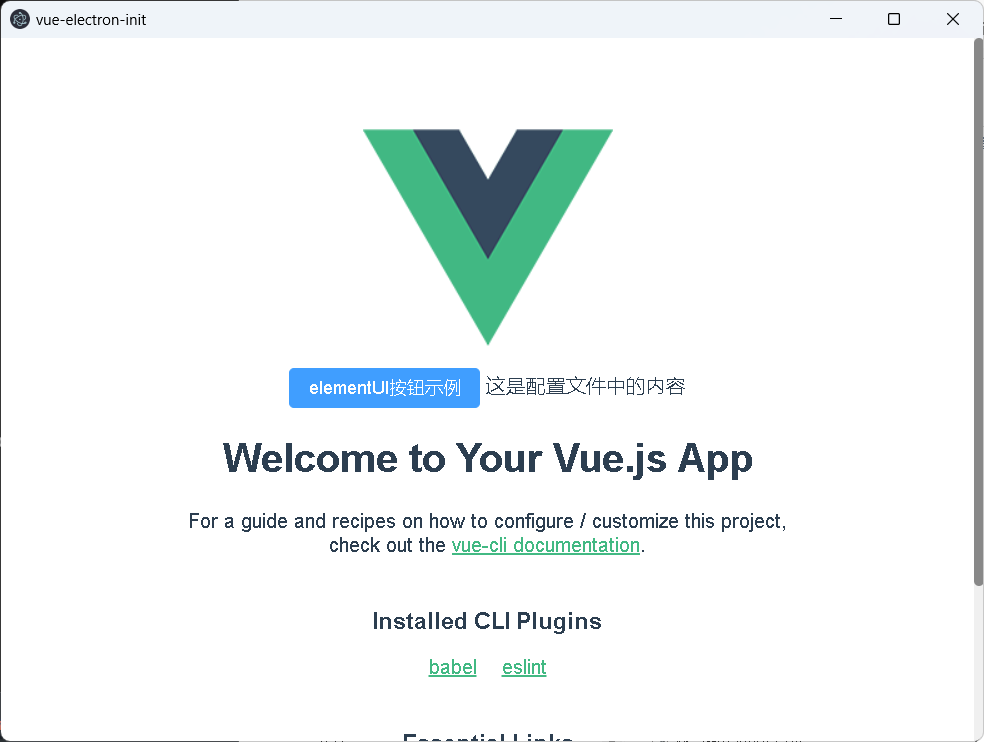
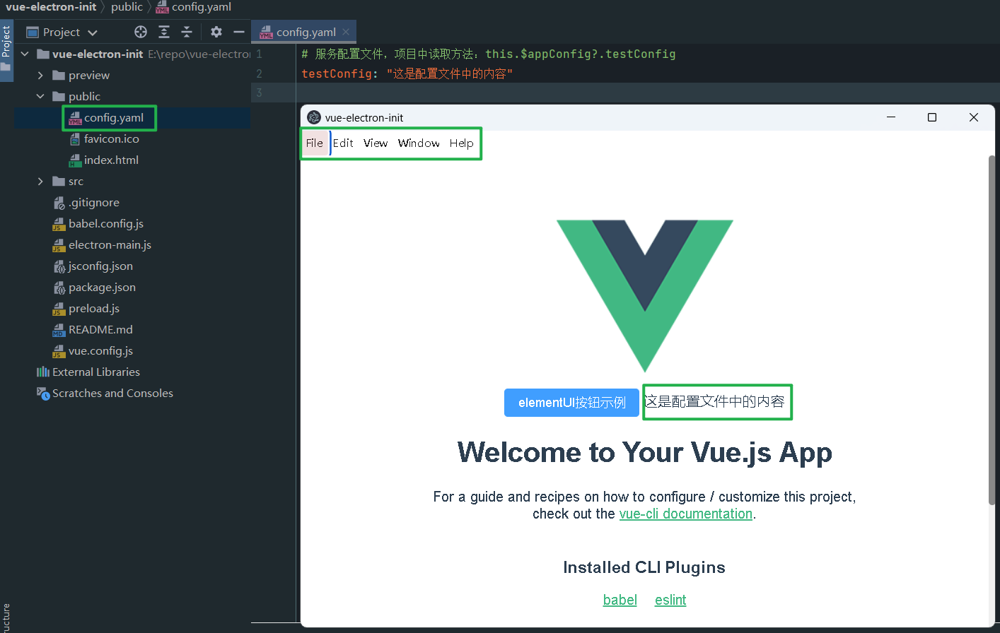

# vue-electron-init
可以将vue项目打包为网站或者app使用

## 安装依赖
```
npm install
```

### 以网站形式运行
```
npm run serve
```

### 以网站形式打包
```
npm run build
```

### 以应用形式运行
```
npm run electron:serve
```

### 以应用形式打包
```
npm run electron:build
```

## 其他说明
### 读取文件公共方法
```javascript
// 读写文件注册为公共方法，避免web方式访问权限问题，使用方法：
window.electronAPI.readFile(this.filePath);
// 异步，运行读取方法后，读取结果在onReadFileReply方法中回调，回调方法可以写在mounted()生命周期函数中：
window.electronAPI.onReadFileReply((event, data) => {
    this.fileContent = data;
    this.message = '文件读取成功';
});
```

### 写入文件公共方法
```javascript
// 读写文件注册为公共方法，避免web方式访问权限问题，使用方法：
window.electronAPI.writeFile(this.filePath, this.fileContent);
// 异步，运行写入方法后，写入成功后在onWriteFileReply方法中回调，回调方法可以写在mounted()生命周期函数中：
window.electronAPI.onWriteFileReply((event, message) => {
    this.message = message;
});
```

### 读取配置文件
``` javascript
// 默认读取跟目录下的：config.yaml配置文件（public/config.yaml，打包为app后此文件在app根目录）, 在项目中使用配置文件内容示例
this.$appConfig?.testConfig
```

## 预览图片


`按键盘Alt可显示左上角菜单栏`

